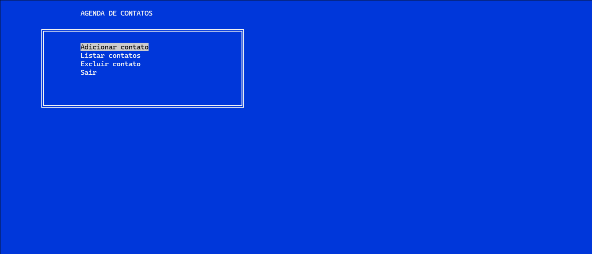

# Harbour Agenda

A small command-line contact agenda written in Harbour (xBase).

## Background

This project is a recreation of one of the first programs I ever wrote.
As a teenager, I built a simple contact agenda using Clipper, an xBase programming language widely used in DOS business software during the 1980s and 1990s.

Rebuilding it in Harbour was a way to revisit that early programming experience while exploring how the modern open-source Harbour compiler continues the xBase ecosystem.

## Features

* Add contacts
* List contacts
* Delete contacts
* Confirmation before deletion
* Terminal-based interface

## Project Structure

src/
    agenda.prg

## Requirements

To compile the project you need the Harbour compiler installed.

## Build

Compile the program using the Harbour build tool:

hbmk2 src/agenda.prg

Or run the provided build script:

build.bat

## Run

After compiling, execute:

```
agenda.exe
```

## Technologies

* Harbour (xBase compiler)
* DBF database format
* Terminal interface

## Purpose

This project was created as a small exercise to:

* revisit an early programming project
* explore the Harbour toolchain
* demonstrate basic CLI application structure using xBase

## License

This project is open for educational and demonstration purposes.

## Screenshot


